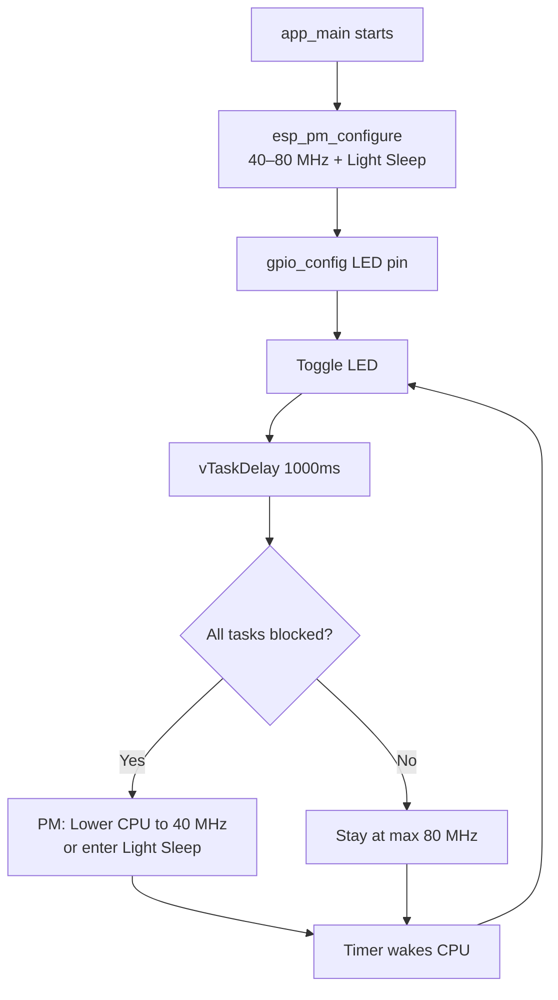

# ESP-IDF Dynamic Frequency Scaling

A minimal ESP32-S3 app that blinks an LED using **Dynamic Frequency Scaling (DFS)** and **Light Sleep** to reduce power consumption.

## Features
- CPU scales between **40 MHz** (idle) and **80 MHz** (active)
- Automatic **Light Sleep** when all tasks are blocked
- Simple GPIO blink with UART logging

## Requirements
- ESP-IDF v5.x or v6.x
- ESP32-S3 (or compatible ESP32 variant)

## Configuration
Run `idf.py menuconfig` and enable:

| Option | Path |
|---|---|
| Power Management | `Component config → Power Management` |
| Tickless Idle | `Component config → FreeRTOS → Kernel` |

## Build & Flash
```bash
idf.py set-target esp32s3
idf.py build
idf.py -p /dev/ttyUSB0 flash monitor
```

## How It Works


## Power States
| State | Frequency | Notes |
|---|---|---|
| Active | 80 MHz | During GPIO toggle and logging |
| Idle | 40 MHz | Between delays |
| Light Sleep | — | Entered automatically by PM |
```
